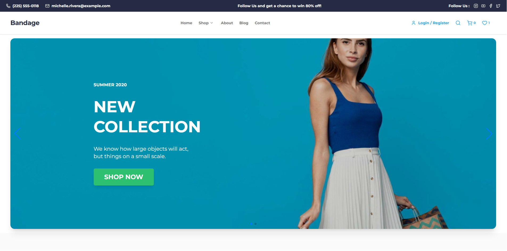
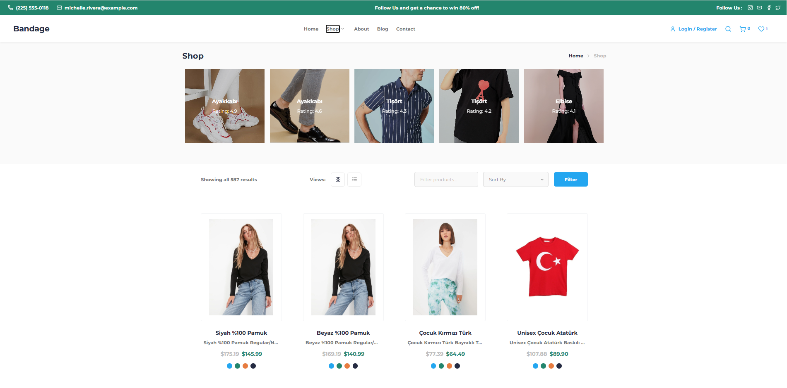
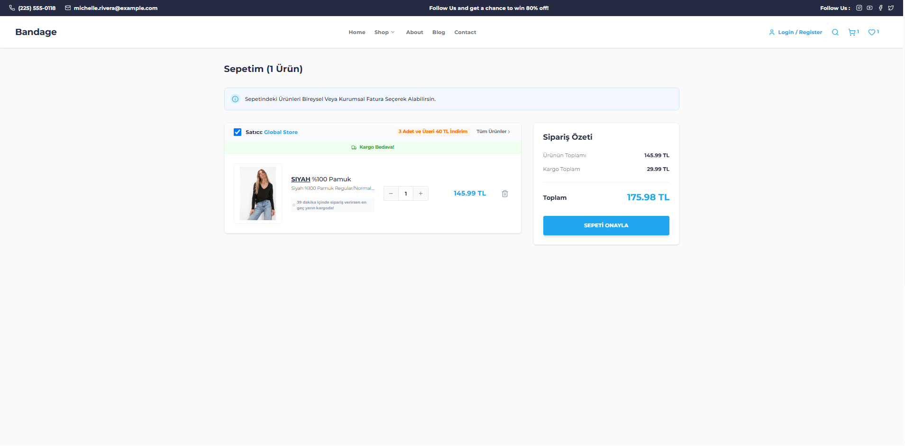
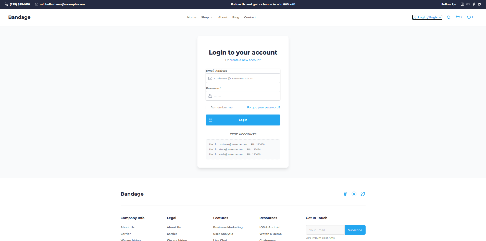

# Bandage E-Commerce

Bandage is a modern, responsive e-commerce frontend built with React, Redux, and Tailwind CSS. It includes multi-page navigation, product listings and filtering, a shopping cart, user authentication (login/signup with token verification), and order history, backed by a live REST API.

**Live demo:**https://bandagge-e-commerce-project-zq68.vercel.app/

## Screenshots

## Features

- **Authentication**: Login/signup with token persistence and verification on app load.
- **Product Catalog**: Category filtering, product detail pages, image galleries.
- **Shopping Cart**: Add/remove items, quantity management, persisted cart state.
- **Order History**: View previous orders for logged-in users.
- **Responsive Design**: Optimized for mobile, tablet, and desktop.
- **Toast Notifications**: User feedback via react-toastify.

## Tech Stack

- **React 19** with functional components and hooks.
- **Redux + Redux Thunk**: Global state management for auth, products, and cart.
- **React Router**: Client-side navigation.
- **Tailwind CSS**: Utility-first styling.
- **Axios**: API communication with the [Workintech e-commerce API](https://workintech-fe-ecommerce.onrender.com).
- **Vite**: Build tooling and dev server.

## Project Structure

- `src/pages`: Page-level components (Home, Shop, Product, Cart, Login, Signup, Orders, About, Team, Contact).
- `src/components`: Reusable UI elements (product cards, sliders, filter bar).
- `src/layout`: Header, footer, and page layout wrappers.
- `src/redux`: Actions and reducers for client, product, and cart state.
- `public`: Static images — referenced with root-relative paths (e.g. `/filter.png`), required for images to resolve correctly after a Vite production build.

## Getting Started

1. Clone the repository
2. Install dependencies: `npm install`
3. Run the dev server: `npm run dev`
4. Build for production: `npm run build`

## Deployment

Deployed on Vercel. Build command: `npm run build`, output directory: `dist`. No environment variables are required — the app talks directly to the public Workintech e-commerce API.

## License

MIT
